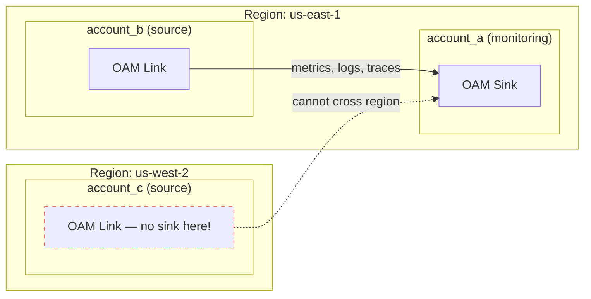
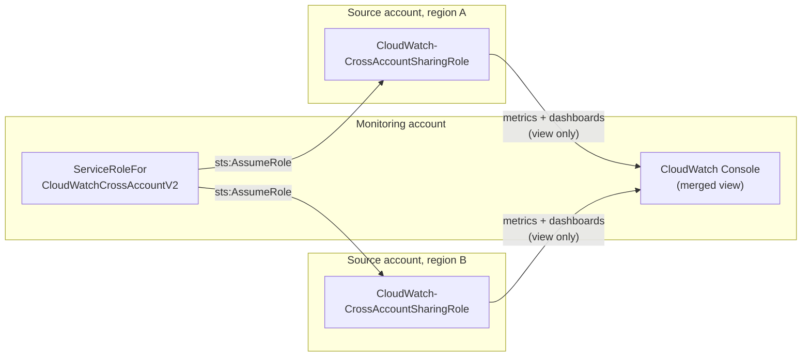
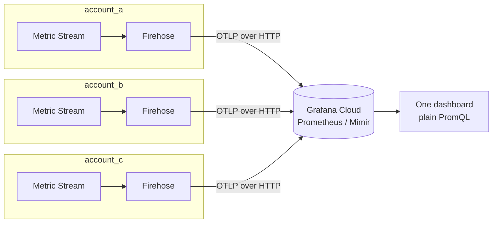

# Combining CloudWatch
## Across Accounts and Regions

<small>An AWS meetup talk</small>

<aside class="notes">
Intro yourself, set expectations: 15 minutes, 3 approaches, a reference repo people can
take home. This *is* a live demo now — 3 real AWS accounts, real EC2 instances, real
Grafana dashboards, all wired up and working end to end.
</aside>

---

## Follow along

<small class="qr-caption">Scan for the repo — slides, Terraform, and docs</small>

<aside class="notes">
Give people a few seconds to scan before you start. The QR points at the GitHub repo, so
they can follow along in the source and the deck lives right there in slides/.
</aside>

---

## What is CloudWatch?

CloudWatch isn't one thing — it's a family of sub-services:

- **Metrics** — numeric time series (CPUUtilization, custom app metrics)
- **Logs** + **Logs Insights** — log storage and querying
- **Alarms** — thresholds/anomaly detection triggering actions
- **Dashboards** — visualization
- **Events / EventBridge**, **Synthetics**, **RUM**, **Contributor Insights** — and more

**This talk focuses on Metrics.** We'll also skip the `GetMetricData` endpoint.

<aside class="notes">
Point being: "CloudWatch" as a word covers a lot of ground, and cross-account/cross-region
support differs *per sub-service*, which is exactly why there are multiple approaches
instead of one. Events/EventBridge react to state changes, Synthetics runs scripted
canaries, RUM is real user monitoring for web apps, Contributor Insights does top-N
analysis over logs.

Scope note: everything that follows is about Metrics specifically — the other sub-services
are out of scope today. Also skipping the `GetMetricData` API endpoint: it's the direct
pull-based way to read metric values, but the cross-account/cross-region story here is about
OAM, the console feature, and Metric Streams, not hand-rolling GetMetricData calls.
</aside>

---

## What is an AWS Account?

A billing, security, and blast-radius boundary.

- Separate IAM, separate limits, separate invoice
- Resources in one account are invisible to another by default
- Common pattern: many accounts, one per team/env/workload

---

## What is an AWS Region?

A physical isolation boundary — a cluster of data centers in one geography.

- Most AWS services, including CloudWatch, are **regional**
- A metric published in `us-east-1` doesn't exist in `eu-central-1`
- Nothing crosses a region boundary unless something explicitly moves it there

---

## The problem

N accounts × M regions = fragmented visibility

- Where do I look for this metric?
- How many browser tabs / console logins does "checking on prod" require?
- Alarms can't span what you can't see

---

## The demo setup

<!-- .slide: class="demo-setup" -->

3 real AWS accounts, 2 regions, 1 EC2 instance each:

| Account | Region | Role | Instance |
|---|---|---|---|
| `account_a` | us-east-1 | monitoring account | `i-01c26eedadfd81489` |
| `account_b` | us-east-1 | source, same region | `i-0d8eb892991961cac` |
| `account_c` | us-west-2 | source, different region | `i-0471d5a973730b195` |

`account_a` + `account_b` share a region on purpose (proves real cross-account
linking); `account_c` sits elsewhere on purpose (proves the region boundary).

<aside class="notes">
This is the fixture every "live" slide refers back to. Each account runs one small EC2
instance publishing CPUUtilization — that's the metric all 3 approaches are shown pulling
across the account/region boundary. account_c's separate region is the one that exposes
OAM's "sinks/links can't cross regions" limitation later, and it's also the account left
out of Approach 2's automatic cross-region graphing story if the console feature isn't
configured for it too. Real account IDs deliberately not shown on screen.
</aside>

---

## Approach 1: OAM

**Observability Access Manager** — AWS's current recommended default

- **Sink** (monitoring account, one per region)
- **Sink policy** (who's allowed to link — scope to an Organization)
- **Link** (each source account, one per region, per telemetry type)

Covers metrics, logs, traces, X-Ray — the richest picture.

**Catch**: sinks/links can't cross regions.

<aside class="notes">
N regions = N sinks + N×(source accounts) links. Reference terraform/oam.tf in the repo.
Mention aws-samples' OAM Terraform example repo for anyone who wants a deeper starting
point.
</aside>

---

## Approach 1: OAM, diagrammed

<aside class="notes">
Sink lives in account_a's region. account_b links in fine — same region. account_c tries
to link but there's no sink in us-west-2, so nothing arrives — that dotted line is the
catch made visual.
</aside>

---

## Approach 1, live

Dashboard: **"1: OAM Cross-Account View"**

- `account_a` (us-east-1) is the OAM monitoring account
- `account_b` (us-east-1) links into it — zero direct connection, yet its
  CPUUtilization shows up on account_a's dashboard
- `account_c` (us-west-2) is **deliberately not visible** — different region

<aside class="notes">
Point at the two series on the graph and say which account each instance ID belongs to.
account_c has no link, no sink in its region — that gap on screen is the "sinks/links
can't cross regions" catch, live. The empty region-3 panel is the punchline, not a bug —
say so explicitly.
</aside>

---

## Approach 2: Cross-account, cross-Region console

<!-- .slide: class="tight" -->

Older IAM-role mechanism (`CloudWatch-CrossAccountSharingRole` /
`ServiceRoleForCloudWatchCrossAccountV2`)

- ✅ Metrics/dashboards, **automatic cross-region graphing**, no per-region setup
- ❌ No logs
- ❌ No cross-account/cross-region alarms — view only
- ⚠️ A few sub-features (automatic dashboards, org-wide account selector) need
  extra setup beyond the base IAM roles

Simplest option if all you need is "one dashboard, many accounts and regions, metrics
only."

---

## Approach 2: console, diagrammed

<aside class="notes">
One role in the monitoring account assumes a same-named sharing role in every source
account, in any region, automatically — that's what makes cross-region graphing "free"
here versus OAM. But the merged result only exists inside this console UI.
</aside>

---

## Approach 2, live — or rather, not

<!-- .slide: class="tight" -->

Dashboard: **"2: Cross-Account Console (not representable in Grafana)"**

This is the one approach with **no metrics panel** — on purpose.

- The IAM roles (`terraform/cross-account-console.tf`) share into `account_b`
  and `account_c`
- The merged view only ever renders **inside the AWS Console itself**
- No API surface for it — nothing a third-party tool can call
- All 3 accounts confirmed live in the console: `account_a`, `account_b`
  (us-east-1), and `account_c` (us-west-2) — cross-region graphing, for real

<aside class="notes">
The console view lives at CloudWatch → Settings → "Cross-account cross-region" (not the
similarly-named OAM "Monitoring account" page — the two are easy to conflate since both
use "monitoring account" terminology and have similar-looking settings screens; verified
by diffing the actual IAM policy JSON shown on each against the corresponding Terraform
resource). Grafana's CloudWatch data source always queries via its own assumed role, so
there's no API surface for "the monitoring-account merged view" it could hit. Good moment
to flip to the actual AWS Console and show the real feature, since Grafana can't. This is
an honest limitation, not a gap in the demo.

Real gotchas hit wiring this up live, worth mentioning if there's time: (1) the sharing
role resource originally had no explicit provider, so it silently deployed to the org's
management account instead of account_b/account_c — the console only showed account_a's
own region until that was fixed. (2) an org-wide SCP restricting requests to specific
regions threw an explicit-deny on cloudwatch:ListDashboards while the console's region
selector was set to a region outside that allow-list — switching back to us-east-1
resolved it. (3) the "AWS Organization account selector" option needs a separate,
CFN-only role in the management account; switched to "Custom account selector" instead
(manually list account IDs) and it worked immediately, no extra role needed. (4) the
CloudWatch automatic-dashboards view (the built-in EC2 fleet dashboard) showed "Cross
account unavailable" and "No data" even with everything else working — that view needs
its own explicit "Include CloudWatch automatic dashboards" sharing checkbox, separate
from the base CloudWatchReadOnlyAccess grant; plain Metrics → All metrics browsing for
the same underlying CPUUtilization data worked the whole time. All four are "the demo
looked broken but the approach wasn't" moments — full detail in docs/gotchas.md.
</aside>

---

## Approach 3: Export / stream it out

CloudWatch Metric Streams → Kinesis Firehose → S3 or a third-party sink

- The only approach that gives **true consolidation** into one store
- Needed for long retention or feeding external tools (Grafana, Datadog, ...)
- Each region needs its own stream; can share one destination

---

## Approach 3: export, diagrammed

<aside class="notes">
Every account/region streams independently and directly to the same external store —
no monitoring account, no assumed roles at query time. This is the one topology where
the "many accounts" problem actually disappears at the data layer, not just the UI layer.
</aside>

---

## Approach 3, live

Dashboard: **"3: Metric Streams (OTLP) via Grafana Prometheus"**

- All 3 accounts stream metrics independently into the same Grafana Cloud
  Prometheus (Mimir) instance
- Queried with plain PromQL (`aws_ec2_cpuutilization_average`) — this
  dashboard has no CloudWatch data source at all
- One graph, 3 accounts, 2 regions, no per-account/region query fan-out

<aside class="notes">
This is what "true consolidation" actually looks like, not just "a nicer view" — one
query hits every account at once instead of fanning out per account/region.
</aside>

---

## Sending it to Grafana Cloud

- Grafana's CloudWatch data source uses the **Assume Role** method
- Grafana's AWS account assumes an IAM role you create, via STS + an `externalId`
- **No long-lived AWS keys** ever leave your account
- One data source per region recommended — or point at your OAM monitoring account's
  aggregated view to need only one role

---

## Which one, when?

| Need | Pick |
|---|---|
| Full telemetry (metrics+logs+traces) | OAM |
| Simplest cross-region metrics dashboard | Console feature |
| True consolidation / 3rd-party sink | Export / Metric Streams |

They compose — mix and match per-region or per-tool.

<aside class="notes">
E.g. OAM per-region + the console feature on top, or OAM internally + Metric Streams
feeding Grafana externally.
</aside>

---

## What actually broke

<!-- .slide: class="tight" -->

The concepts are clean; the implementation had sharp edges:

- Grafana's CloudWatch auth needs an exact `authType`
- OAM discovery needs IAM perms beyond `CloudWatchReadOnlyAccess`
- OTLP→Prometheus metric names aren't a mechanical transform
- Hand-built dashboard JSON can be backend-valid but **frontend-inert**

Full list: `docs/gotchas.md`

<aside class="notes">
Auth: needs the exact `authType = "grafana_assume_role"` — not `"default"` +
assumeRoleArn, not `"arn"`. OAM: needs `oam:ListSinks`/`oam:ListAttachedLinks` on top of
CloudWatchReadOnlyAccess, or the link is invisible to Grafana. OTLP naming: e.g.
`network_in`, not `networkin`. Frontend-inert: the CloudWatch query editor silently
refuses to fire queries missing 4 fields (accountId, metricEditorMode, metricQueryType,
queryMode), with no error anywhere. This one cost the most time — healthy datasource,
correct data returned by the exact same query called directly via the API, yet the live
dashboard panel showed "No data" with zero errors in the console or network tab. Worth
calling out as the "if you build dashboards by hand, watch for this" takeaway.
</aside>

---

## What does this cost?

<!-- .slide: class="tight" -->

Real Cost Explorer numbers, yesterday, all 3 accounts combined — **by approach**:

| Approach | Cost | Why |
|---|---|---|
| 1: OAM | **$0** | metadata-only reads, no metering |
| 2: Console feature | **$0** | assumed-role reads, no metering |
| 3: Metric Streams | **$0.38 CW + $0.02 Firehose/S3** | billed per metric update |
| EC2 (all 3) | **$0.016** | t3.micro, mostly free tier |

**≈ $0.41/day → ~$12/month**, and it's ~95% one approach.

<aside class="notes">
Broke this down via `aws ce get-cost-and-usage --group-by USAGE_TYPE --filter SERVICE=AmazonCloudWatch`
— the only two CloudWatch usage-type line items yesterday were USE1-CW:MetricStreamUsage
($0.26) and USW2-CW:MetricStreamUsage ($0.12), ~86k + ~41k "Metric Update"s respectively.
That's Approach 3 exclusively — OAM sinks/links and the console cross-account IAM roles
generate zero metered usage, they're just read paths through existing metric storage.
</aside>

---

## Cost scales with what you stream

You can filter what a Metric Stream sends: `include_filter` / `exclude_filter`
scope by namespace (and optionally metric name).

This demo's `aws_cloudwatch_metric_stream` has neither, so it streams
**every metric, every namespace**, in each account.

<aside class="notes">
Filtering note: terraform/modules/metric-stream/main.tf's aws_cloudwatch_metric_stream
resource has no include_filter/exclude_filter, so every namespace (EC2, Lambda, RDS, S3,
whatever else exists in the account) streams out continuously, even though the dashboards
only ever query AWS/EC2 CPUUtilization. Scoping it down to
`include_filter { namespace = "AWS/EC2" }` — or even to specific metric_names — would cut
the ~127k daily metric updates to a small fraction of that, with a proportional cost drop.
Left unfiltered here deliberately, to make the "cost scales with what you stream, not with
how many accounts you aggregate" point concretely measurable rather than theoretical.
Firehose/S3 costs are the same story: that's the export pipeline underneath Metric Streams.
The takeaway for anyone budgeting this: OAM and the console feature are effectively free to
turn on: cost scales with what you *stream out*, not with how many accounts/regions you
aggregate for viewing.
</aside>

---

## Reference repo

Terraform, docs, this deck, and now a **working real-infra path**:

- 3 real AWS accounts, 3 EC2 instances, all 3 approaches demoed live in Grafana
- Illustrative path still available — reads org context via `data` sources,
  provisions nothing until you opt in (see `README.md` for the gate)
- Adapt the resource blocks to your own environment before applying

Thanks! Questions?

---

## Take it home

<small class="qr-caption">The whole repo — slides, Terraform, and docs</small>

<aside class="notes">
Leave this up during Q&A so people can grab the repo on their way out.
Same URL as the follow-along QR at the start.
</aside>
