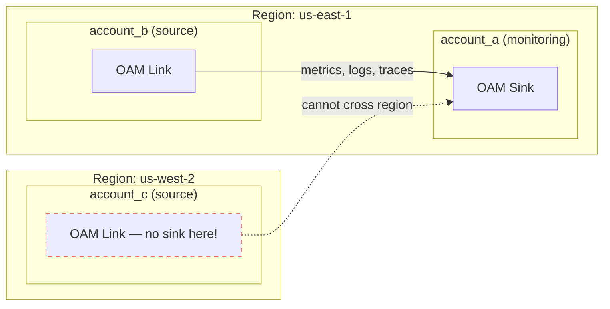
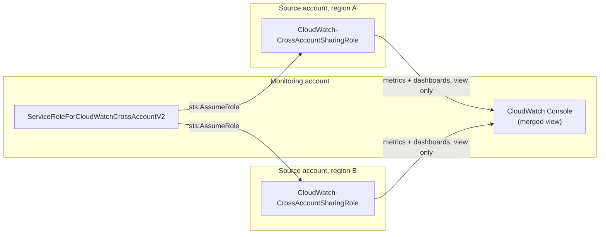
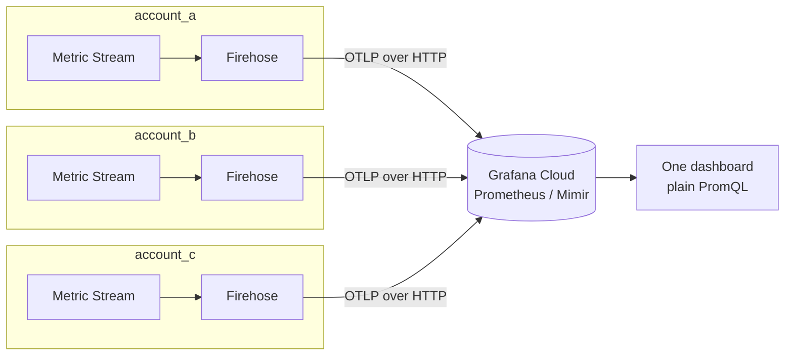

# Combining CloudWatch
## Across Accounts and Regions

<small>An AWS meetup talk</small>

<aside class="notes">
Intro yourself, set expectations: 15 minutes, 3 approaches, a reference repo people can
take home. This *is* a live demo now — 3 real AWS accounts, real EC2 instances, real
Grafana dashboards, all wired up and working end to end.
</aside>

---

## What is CloudWatch?

CloudWatch isn't one thing — it's a family of sub-services:

- **Metrics** — numeric time series (CPUUtilization, custom app metrics)
- **Logs** + **Logs Insights** — log storage and querying
- **Alarms** — thresholds/anomaly detection triggering actions
- **Dashboards** — visualization
- **Events / EventBridge**, **Synthetics**, **RUM**, **Contributor Insights** — and more

<aside class="notes">
Point being: "CloudWatch" as a word covers a lot of ground, and cross-account/cross-region
support differs *per sub-service*, which is exactly why there are multiple approaches
instead of one. Events/EventBridge react to state changes, Synthetics runs scripted
canaries, RUM is real user monitoring for web apps, Contributor Insights does top-N
analysis over logs.
</aside>

---

## What is an AWS Account?

A billing, security, and blast-radius boundary.

- Separate IAM, separate limits, separate invoice
- Resources in one account are invisible to another by default
- Common pattern: many accounts, one per team/env/workload

---

## What is an AWS Region?

A physical isolation boundary — a cluster of data centers in one geography.

- Most AWS services, including CloudWatch, are **regional**
- A metric published in `us-east-1` doesn't exist in `eu-central-1`
- Nothing crosses a region boundary unless something explicitly moves it there

---

## The problem

N accounts × M regions = fragmented visibility

- Where do I look for this metric?
- How many browser tabs / console logins does "checking on prod" require?
- Alarms can't span what you can't see

---

## Approach 1: OAM

**Observability Access Manager** — AWS's current recommended default

- **Sink** (monitoring account, one per region)
- **Sink policy** (who's allowed to link — scope to an Organization)
- **Link** (each source account, one per region, per telemetry type)

Covers metrics, logs, traces, X-Ray — the richest picture.

**Catch**: sinks/links can't cross regions.

<aside class="notes">
N regions = N sinks + N×(source accounts) links. Reference terraform/oam.tf in the repo.
Mention aws-samples' OAM Terraform example repo for anyone who wants a deeper starting
point.
</aside>

---

## Approach 1: OAM, diagrammed

<aside class="notes">
Sink lives in account_a's region. account_b links in fine — same region. account_c tries
to link but there's no sink in us-west-2, so nothing arrives — that dotted line is the
catch made visual.
</aside>

---

## Approach 1, live

Dashboard: **"1: OAM Cross-Account View"**

- `account_a` (us-east-1) is the OAM monitoring account
- `account_b` (us-east-1) links into it — zero direct connection, yet its
  CPUUtilization shows up on account_a's dashboard
- `account_c` (us-west-2) is **deliberately not visible** — different region

<aside class="notes">
Point at the two series on the graph and say which account each instance ID belongs to.
account_c has no link, no sink in its region — that gap on screen is the "sinks/links
can't cross regions" catch, live. The empty region-3 panel is the punchline, not a bug —
say so explicitly.
</aside>

---

## Approach 2: Cross-account, cross-Region console

Older IAM-role mechanism (`CloudWatch-CrossAccountSharingRole` /
`ServiceRoleForCloudWatchCrossAccountV2`)

- ✅ Metrics/dashboards, **automatic cross-region graphing**, no per-region setup
- ❌ No logs
- ❌ No cross-account/cross-region alarms — view only

Simplest option if all you need is "one dashboard, many accounts and regions, metrics
only."

---

## Approach 2: console, diagrammed

<aside class="notes">
One role in the monitoring account assumes a same-named sharing role in every source
account, in any region, automatically — that's what makes cross-region graphing "free"
here versus OAM. But the merged result only exists inside this console UI.
</aside>

---

## Approach 2, live — or rather, not

Dashboard: **"2: Cross-Account Console (not representable in Grafana)"**

This is the one approach with **no metrics panel** — on purpose.

- The IAM roles exist (`terraform/cross-account-console.tf`) and work
- The merged view only ever renders **inside the AWS Console itself**
- No API surface for it — nothing a third-party tool can call

<aside class="notes">
The console view lives at CloudWatch → Settings → Monitoring account configuration.
Grafana's CloudWatch data source always queries via its own assumed role, so there's
no API surface for "the monitoring-account merged view" it could hit. Good moment to
flip to the actual AWS Console and show the real feature, since Grafana can't. This is
an honest limitation, not a gap in the demo.
</aside>

---

## Approach 3: Export / stream it out

CloudWatch Metric Streams → Kinesis Firehose → S3 or a third-party sink

- The only approach that gives **true consolidation** into one store
- Needed for long retention or feeding external tools (Grafana, Datadog, ...)
- Each region needs its own stream; can share one destination

---

## Approach 3: export, diagrammed

<aside class="notes">
Every account/region streams independently and directly to the same external store —
no monitoring account, no assumed roles at query time. This is the one topology where
the "many accounts" problem actually disappears at the data layer, not just the UI layer.
</aside>

---

## Approach 3, live

Dashboard: **"3: Metric Streams (OTLP) via Grafana Prometheus"**

- All 3 accounts stream metrics independently into the same Grafana Cloud
  Prometheus (Mimir) instance
- Queried with plain PromQL (`aws_ec2_cpuutilization_average`) — this
  dashboard has no CloudWatch data source at all
- One graph, 3 accounts, 2 regions, no per-account/region query fan-out

<aside class="notes">
This is what "true consolidation" actually looks like, not just "a nicer view" — one
query hits every account at once instead of fanning out per account/region.
</aside>

---

## Sending it to Grafana Cloud

- Grafana's CloudWatch data source uses the **Assume Role** method
- Grafana's AWS account assumes an IAM role you create, via STS + an `externalId`
- **No long-lived AWS keys** ever leave your account
- One data source per region recommended — or point at your OAM monitoring account's
  aggregated view to need only one role

---

## Which one, when?

| Need | Pick |
|---|---|
| Full telemetry (metrics+logs+traces) | OAM |
| Simplest cross-region metrics dashboard | Console feature |
| True consolidation / 3rd-party sink | Export / Metric Streams |

They compose — mix and match per-region or per-tool.

<aside class="notes">
E.g. OAM per-region + the console feature on top, or OAM internally + Metric Streams
feeding Grafana externally.
</aside>

---

## What actually broke

The concepts are clean; the implementation had sharp edges. A sample:

- Grafana's CloudWatch auth needs an exact, undocumented-feeling `authType`
- OAM discovery needs IAM permissions beyond `CloudWatchReadOnlyAccess`
- CloudWatch's OTLP→Prometheus metric names aren't a mechanical transform
- Hand-built dashboard JSON can be backend-valid but **frontend-inert**

Full list: `docs/gotchas.md`

<aside class="notes">
Auth: needs the exact `authType = "grafana_assume_role"` — not `"default"` +
assumeRoleArn, not `"arn"`. OAM: needs `oam:ListSinks`/`oam:ListAttachedLinks` on top of
CloudWatchReadOnlyAccess, or the link is invisible to Grafana. OTLP naming: e.g.
`network_in`, not `networkin`. Frontend-inert: the CloudWatch query editor silently
refuses to fire queries missing 4 fields (accountId, metricEditorMode, metricQueryType,
queryMode), with no error anywhere. This one cost the most time — healthy datasource,
correct data returned by the exact same query called directly via the API, yet the live
dashboard panel showed "No data" with zero errors in the console or network tab. Worth
calling out as the "if you build dashboards by hand, watch for this" takeaway.
</aside>

---

## Reference repo

Terraform, docs, this deck, and now a **working real-infra path**:

- 3 real AWS accounts, 3 EC2 instances, all 3 approaches demoed live in Grafana
- Illustrative path still available — reads org context via `data` sources,
  provisions nothing until you opt in (see `README.md` for the gate)
- Adapt the resource blocks to your own environment before applying

Thanks! Questions?
