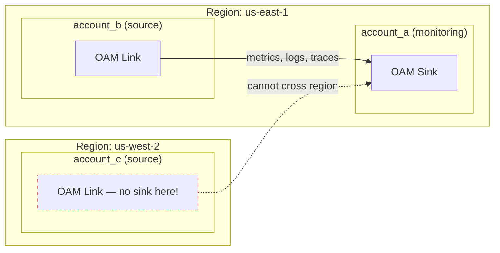
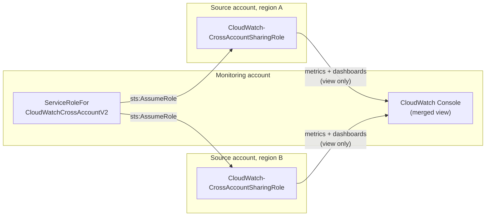
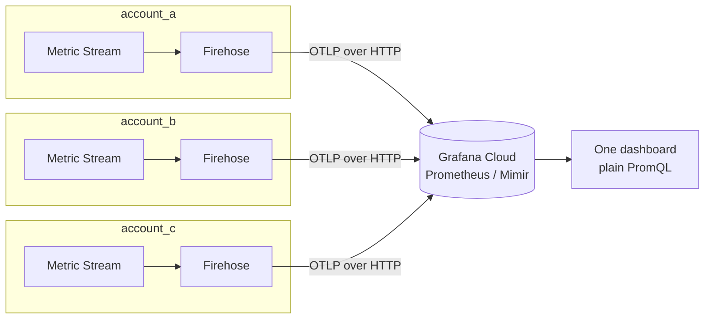

# Combining CloudWatch
## Across Accounts and Regions

<small>Andraž Brodnik — brodul</small>

<small>2026-09-24</small>

<aside class="notes">
Intro yourself, set expectations: 15 minutes, 3 approaches, a reference repo people can
take home. This *is* a live demo — 3 real AWS accounts, real EC2 instances, real
Grafana dashboards, all wired up and working end to end.
</aside>

---

## Follow along

<small class="qr-caption">Scan for the repo — slides, Terraform, and docs</small>

<aside class="notes">
Give people a few seconds to scan before you start. The QR points at the GitHub repo, so
they can follow along in the source and the deck lives right there in slides/.
</aside>

---

## What is CloudWatch?

A family of sub-services, not one thing:

- **Metrics**, **Logs**, **Alarms**, **Dashboards**
- EventBridge, Synthetics, RUM, Contributor Insights, …

Cross-account support differs **per sub-service**.

**This talk: Metrics only** (and not `GetMetricData`).

<aside class="notes">
"CloudWatch" as a word covers a lot of ground, and cross-account/cross-region support
differs per sub-service — which is exactly why there are multiple approaches instead of
one. Events/EventBridge react to state changes, Synthetics runs scripted canaries, RUM is
real user monitoring, Contributor Insights does top-N analysis over logs.

Skipping the GetMetricData API: it's the direct pull-based way to read metric values, but
the story here is OAM, the console feature, and Metric Streams, not hand-rolled API calls.
</aside>

---

## Two boundaries

- **Account** — billing, security, blast radius. Invisible to others by default.
- **Region** — physical isolation. CloudWatch is **regional**: a metric in
  `us-east-1` doesn't exist in `eu-central-1`.

**N accounts × M regions = fragmented visibility**

<aside class="notes">
Accounts: separate IAM, separate limits, separate invoice; common pattern is many accounts,
one per team/env/workload. Regions: nothing crosses a region boundary unless something
explicitly moves it there.

The problem: where do I look for this metric? How many browser tabs / console logins does
"checking on prod" require? Alarms can't span what you can't see.
</aside>

---

## The demo setup

<!-- .slide: class="demo-setup" -->

3 real AWS accounts, 2 regions, 1 EC2 instance each:

| Account | Region | Role | Instance |
|---|---|---|---|
| `account_a` | us-east-1 | monitoring account | `i-01c26eedadfd81489` |
| `account_b` | us-east-1 | source, same region | `i-0d8eb892991961cac` |
| `account_c` | us-west-2 | source, different region | `i-0471d5a973730b195` |

`account_c` sits in another region **on purpose**.

<aside class="notes">
This is the fixture every "live" slide refers back to. Each account runs one small EC2
instance publishing CPUUtilization — the metric all 3 approaches pull across the
account/region boundary. account_a + account_b share a region to prove real
cross-account linking; account_c's separate region exposes OAM's "sinks/links can't
cross regions" limitation later. Real account IDs deliberately not shown on screen.
</aside>

---

## Approach 1: OAM

**Observability Access Manager** — AWS's recommended default

- **Sink** — monitoring account, one per region
- **Link** — each source account, one per region
- Metrics, logs, traces — the richest picture

**Catch**: sinks/links can't cross regions.

<aside class="notes">
There's also a sink policy — who's allowed to link, typically scoped to an Organization.
N regions = N sinks + N×(source accounts) links. Reference terraform/oam.tf in the repo.
Mention aws-samples' OAM Terraform example repo for anyone who wants a deeper starting
point.
</aside>

---

## Approach 1: OAM, diagrammed

<!-- .slide: class="tight" -->

<aside class="notes">
Sink lives in account_a's region. account_b links in fine — same region. account_c tries
to link but there's no sink in us-west-2, so nothing arrives — that dotted line is the
catch made visual.
</aside>

---

## Approach 1, live

Dashboard **"1: OAM Cross-Account View"**
[open in Grafana ↗](https://boldiguana716.grafana.net/public-dashboards/a2f03ab4a1c1487e95903fb0fa7c9a23)

- `account_b` shows up on `account_a`'s dashboard via the link
- `account_c` is **missing** — different region

<aside class="notes">
Point at the two series on the graph and say which account each instance ID belongs to.
account_c has no link, no sink in its region — that gap on screen is the "sinks/links
can't cross regions" catch, live. The empty region-3 panel is the punchline, not a bug —
say so explicitly.

How Grafana gets in: its CloudWatch data source uses the Assume Role method — Grafana's
AWS account assumes an IAM role in account_a via STS + an externalId, so no long-lived
AWS keys ever leave the account. Pointing it at the OAM monitoring account means one role
covers every linked source account. One data source per region is recommended.
</aside>

---

## Approach 2: Cross-account, cross-Region console

Older IAM-role mechanism (`CloudWatch-CrossAccountSharingRole`)

- ✅ Metrics + dashboards, **automatic cross-region**
- ❌ No logs, view-only alarms

Cross-region for free — but **confusing to set up**.

<aside class="notes">
Sub-features like automatic dashboards and the org account selector need extra setup —
see the live slide notes. No per-region setup, unlike OAM.
</aside>

---

## Approach 2: console, diagrammed

<aside class="notes">
One role in the monitoring account assumes a same-named sharing role in every source
account, in any region, automatically — that's what makes cross-region graphing "free"
here versus OAM. But the merged result only exists inside this console UI.
</aside>

---

## Approach 2, live — or rather, not

No Grafana dashboard **on purpose**:

- The merged view only renders **inside the AWS Console**
- No API for it — nothing a third-party tool can call
- In the console: all 3 accounts, both regions ✅

<aside class="notes">
Flip to the actual AWS Console here. The view lives at CloudWatch → Settings →
"Cross-account cross-region" (not the similarly-named OAM "Monitoring account" page — the
two are easy to conflate). IAM roles are in terraform/cross-account-console.tf, sharing
into account_b and account_c. Grafana's CloudWatch data source always queries via its own
assumed role, so there's no API surface for the merged view. Honest limitation, not a gap
in the demo.

Gotchas hit wiring this up, if there's time: (1) the sharing role had no explicit
provider, so it silently deployed to the management account. (2) an org-wide SCP region
restriction threw an explicit-deny on cloudwatch:ListDashboards when the console was set
to a non-allowed region. (3) the "AWS Organization account selector" needs a separate
CFN-only role in the management account — "Custom account selector" worked immediately.
(4) automatic dashboards showed "Cross account unavailable" until the separate "Include
CloudWatch automatic dashboards" checkbox was ticked. Full detail in docs/gotchas.md.
</aside>

---

## Approach 3: Export / stream it out

Metric Streams → Kinesis Firehose → S3 or a third-party sink

- **True consolidation** of AWS service metrics (`AWS/EC2`, …) into one store
- Long retention, external tools (Grafana, Datadog, …)
- One stream per account/region, shared destination

<aside class="notes">
AWS also has a newer built-in option, cross-account cross-Region centralization: rules
in the Organization copy logs and metrics into one destination account/region. But its
metrics support is custom metrics only (PutMetricData, EMF, OTLP), and it requires AWS
Organizations. For AWS service metrics like EC2 CPUUtilization, and for sending
anywhere outside CloudWatch, Metric Streams is still the way.
</aside>

---

## Approach 3: export, diagrammed

<aside class="notes">
Every account/region streams independently and directly to the same external store —
no monitoring account, no assumed roles at query time. This is the one topology where
the "many accounts" problem actually disappears at the data layer, not just the UI layer.
</aside>

---

## Approach 3, live

Dashboard **"3: Metric Streams (OTLP)"**
[open in Grafana ↗](https://boldiguana716.grafana.net/public-dashboards/de83085e81794d9e81cc16a334236671)

- All 3 accounts, both regions, **one PromQL query**
- No CloudWatch data source at all

<aside class="notes">
All 3 accounts stream into the same Grafana Cloud Prometheus (Mimir) instance, queried
with plain PromQL (aws_ec2_cpuutilization_average). This is what "true consolidation"
looks like — one query hits every account at once instead of fanning out per
account/region.
</aside>

---

## Which one, when?

| Need | Pick |
|---|---|
| Metrics + logs + traces | OAM |
| Cross-region view in the AWS Console | Console feature |
| One store in a tool you already run | Metric Streams |

They compose — mix and match.

<aside class="notes">
E.g. OAM per-region + the console feature on top, or OAM internally + Metric Streams
feeding Grafana externally.
</aside>

---

## They compose — AWS does it too

**Database Insights** (RDS / Aurora) cross-account, cross-region needs **both**:

- **OAM** — the telemetry, set up **in every region**
- **Console feature** — the cross-region reach, set up **once** (global)

Fleet view: up to **3 regions** at a time, read-only.

<aside class="notes">
Launched Nov 2025. AWS's own newer feature doesn't pick one mechanism, it stacks both —
and the page never claims OAM itself crosses regions. OAM is per-region, so its setup is
repeated in every region; the console feature is a global setting, done once, and that's
what supplies the cross-region part. OAM monitoring account must share at least Logs,
Metrics, Traces, and Application Signals (Services, SLOs). The console sharing role needs
"Include CloudWatch automatic dashboards" + "Include read-only access for Database
Insights" (or full read-only) — the automatic-dashboards checkbox is the same one that bit
us in the Approach 2 demo. Limits: Fleet Health Dashboard shows max 3 regions at once;
monitoring account is read-only (no performance analysis reports); alarms, fleet views
and custom instance dashboards live in the monitoring account only; no tag filtering in
cross-account cross-region mode. Not deployed here — no RDS databases in
the demo accounts. Source: docs.aws.amazon.com/AmazonCloudWatch/latest/monitoring/
Database-Insights-Cross-Account-Cross-Region.html
</aside>

---

## What it costs

<!-- .slide: class="tight" -->

| Approach | Cost | Why |
|---|---|---|
| 1: OAM | **$0** | query-time read |
| 2: Console | **$0** | query-time read |
| 3: Metric Streams | **~$21/month** | write-time: every update re-emitted |

Demo: 582 metrics, 235,616 updates/day at $0.003 / 1,000.
Filtering to `AWS/EC2` would cut it **5-10x**.

<aside class="notes">
OAM and the console feature read metrics that already exist in CloudWatch's storage —
confirmed via `aws ce get-cost-and-usage --group-by USAGE_TYPE --filter
SERVICE=AmazonCloudWatch`: no line items attributable to OAM sinks/links or the console
IAM roles. Free regardless of how many accounts/regions you aggregate.

Metric Streams bill per metric update. Last 24h: account_a 80,842, account_b 78,594,
account_c 76,180 updates (221 / 194 / 167 metrics streamed). ~$0.71/day. No
include_filter set, so every namespace streams — EBS, Firehose's own metrics, status
checks — even though dashboards only use AWS/EC2 CPUUtilization. Left unfiltered on
purpose: cost scales with what you stream, not with how many accounts you aggregate.
</aside>

---

## Conclusion

- **Start with OAM** — easy: 3 resources, free, metrics + logs + traces
- **Console feature** — cross-region, but confusing and hard to set up
- **Stream out** if you already run the infra for it (Grafana, Datadog, …)
- **Region** is the real boundary, not the account

<aside class="notes">
My take on "OAM is easy": yes, to set up. In this repo it's a sink, a sink policy and a
link — about 55 lines of Terraform, versus ~140 for the console feature's IAM roles and a
Firehose + IAM module per account for Metric Streams. No role assumptions at query time,
no cost, and scoping the sink policy with aws:PrincipalOrgID means new accounts in the
organization can link without touching the policy.

Where it stops being easy: it multiplies. One sink per region, one link per source
account per region — fine for 3 accounts, needs StackSets or Terraform for_each at 50.
And third-party tools need more than CloudWatchReadOnlyAccess: Grafana silently showed
nothing from the linked account until its role got oam:ListSinks / oam:ListAttachedLinks.

The console feature is the opposite: little code, but confusing. Two "monitoring
account" settings screens that look almost identical (OAM vs this), three separate
opt-ins (account selector, org account list, automatic dashboards), a CloudFormation-only
role in the management account for the org selector, and failures that show up as empty
graphs or "Cross account unavailable" rather than errors. Every one of the four Approach 2
gotchas looked like a broken demo.

Streaming out makes sense when you already run the destination — a Grafana, Datadog or
data-lake stack you operate anyway. Standing up Firehose + a sink just for this is a lot
of moving parts and the only option that costs money.

Other takeaways:
- They compose: AWS's own Database Insights uses OAM per region + the console feature
  once, globally.
- Only streaming costs money, and it scales with what you stream, not how many accounts
  you aggregate — set an include_filter.
- The console feature has no API: great for people in the AWS Console, useless for
  Grafana.
- Logs and custom metrics can now also be copied across accounts and regions with
  CloudWatch centralization (requires Organizations).
- Put an explicit provider on every Terraform resource — one without it silently landed
  in the management account here.
</aside>

---

## Take it home

<small class="qr-caption">Terraform for all 3 approaches, docs, and this deck. Questions?</small>

<aside class="notes">
Leave this up during Q&A so people can grab the repo on their way out. Same URL as the
follow-along QR at the start. The repo provisions nothing by default — real infra is
gated behind opt-in variables (see README.md). Adapt the resource blocks to your own
environment before applying.
</aside>
